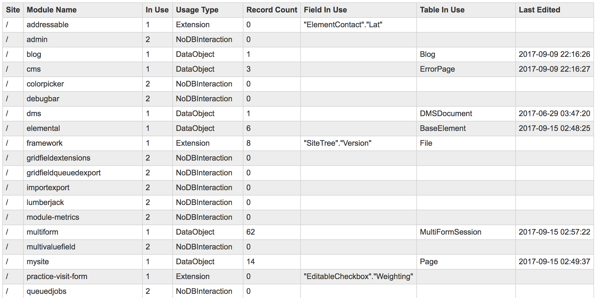

# SilverStripe module-usage inspector

This module aims to supply dev-ops teams with information related to SilverStripe
module usage across many sites. It does this by analysing a modules DataObjects and DataExtension classes.
1. DataObjects: if at least one of them has rows, it assumes the module is in use
2. DataExtensions: if any new columns are introduced by these with non-null values, it assumes the module is in use.

NB: `DataExtension::augmentDataBase()` also mutates the database (see Versioned or Translatable), but there is no structured way to determine what those mutations are. For these modules
   some analysis at a module-level is required to determine which table's existence can reliably determine the module's usage.

## Requirements
 * SilverStripe ^3.1

## Installation and setup
1. Clone down the repository to your `/tmp/ss-module-metrics` directory

```
git clone https://github.com/fspringveldt/silverstripe-module-metrics /tmp/ss-module-metrics
```

2. Create an simple text file in the same directory you cloned this project to (i.e. /tmp/ss-module-metrics), into which you put paths to all the SilverStripe directories
you would like to include in your scan. An example below of a file called `input.txt`, with the following content:

```txt
$HOME/www/ss-site-1
$HOME/www/ss-site-2
```

3. Run the following from your bash command prompt to output its results:

```bash
cd /tmp/ss-module-metrics/ && >output.txt && awk '{printf "php cli-module-metrics.php %s >> output.txt\n", $0}' input.txt | sh

```
*__N.B.__ By including the manifest-like SilverStripe files (Core.php) from your script 
you introduce a possibility of having cache files re-generated, 
which could cause problems for these websites to frontend users. Care must therefore be taken to ensure
 that the script is run as the web server's user.*


4. This command runs the module-usage inspector on all the sites specified in `input.txt`, sends the output in JSON format to a file called `/tmp/ss-module-metrics/output.txt`.
The below fields are output per site, per module. This file can be imported to MySQL for further analysis.

```json
[
  {"Site":"http:\/\/dev.cwp15.local","ModuleName":"admin","InUse":"1","RecordsFound":2,"FieldInUse":"n/a"}
]
```
#### Field descriptions
* **Site**: The output of Director::baseURL()
* **ModuleName**: The actual module
* **InUse**: Either 0, 1 or 2. A value of 2 indicates the module has no Database interaction
* **UsageType**: Can be one of either 
    * Extension - an extension column introduced by this module has valid data (i.e. not null and <> 0)
    * DataObject - a dataobject introduced byt this module has data
    * AugmentDatabase - rows were found in a table introduced through DataExtension::augmentDatabase()
    * NoDBInteraction - no database interaction was found within this module
* **RecordsFound**: The number of records found in the case of a DataObject
* **FieldInUse**: The first DataExtension field found with a non-null value.
* **TableInUse**: The first database table found with a row
* **LastEdited**: The LastEdited column in the table

#### Sample results formatted as table



## License
See [License](license.md)

We have included a 3-clause BSD license you can use as a default. We advocate for the BSD license as 
it is one of the most permissive and open licenses.

Feel free to alter the [license.md](license.md) to suit if you wan tto use an alternative license.
You can use [choosealicense.com](http://choosealicense.com) to help pick a suitable license for your project.

## Maintainers
 * Franco Springveldt <fspringveldt@gmail.com>
 
## Bugtracker
Bugs are tracked in the issues section of this repository. Before submitting an issue please read over 
existing issues to ensure yours is unique. 
 
If the issue does look like a new bug:
 
 - Create a new issue
 - Describe the steps required to reproduce your issue, and the expected outcome. Unit tests, screenshots 
 and screencasts can help here.
 - Describe your environment as detailed as possible: SilverStripe version, Browser, PHP version, 
 Operating System, any installed SilverStripe modules.
 
Please report security issues to the module maintainers directly. Please don't file security issues in the bugtracker.
 
## Development and contribution
If you would like to make contributions to the module please ensure you raise a pull request and discuss with the module maintainers.
